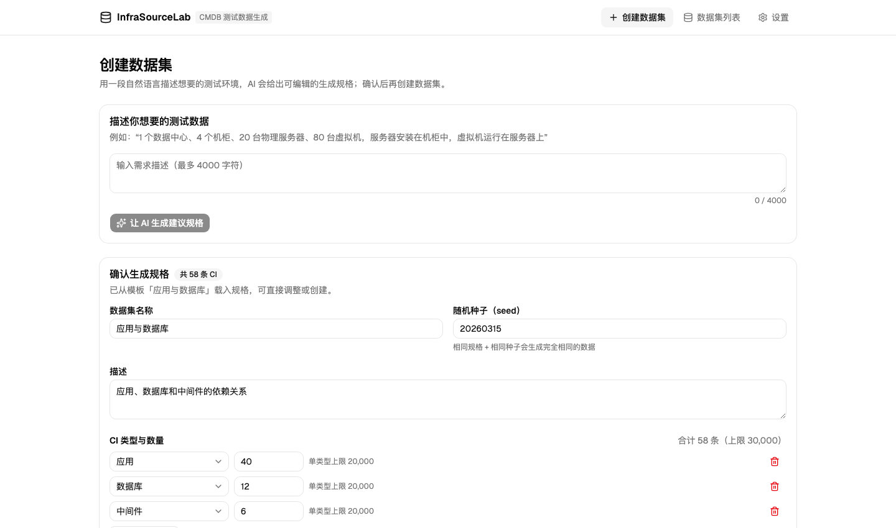
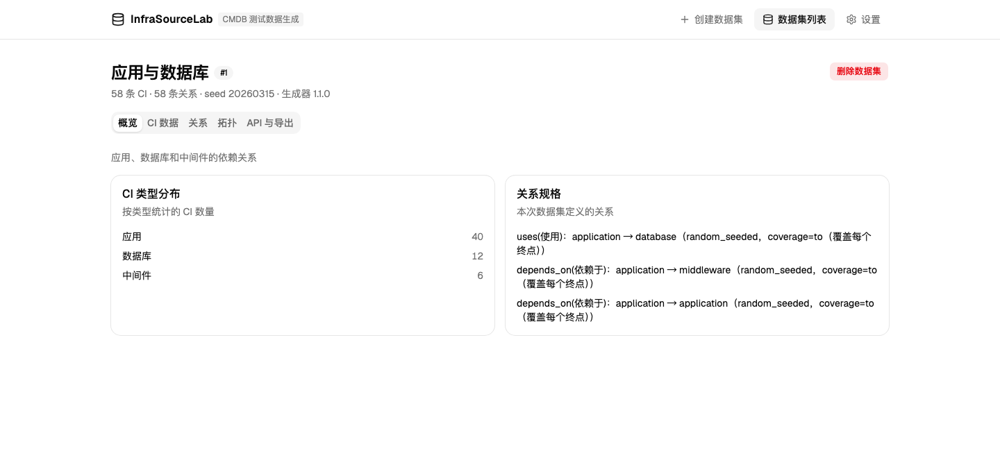
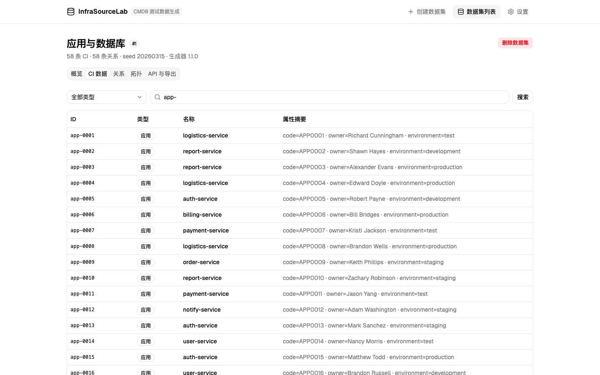
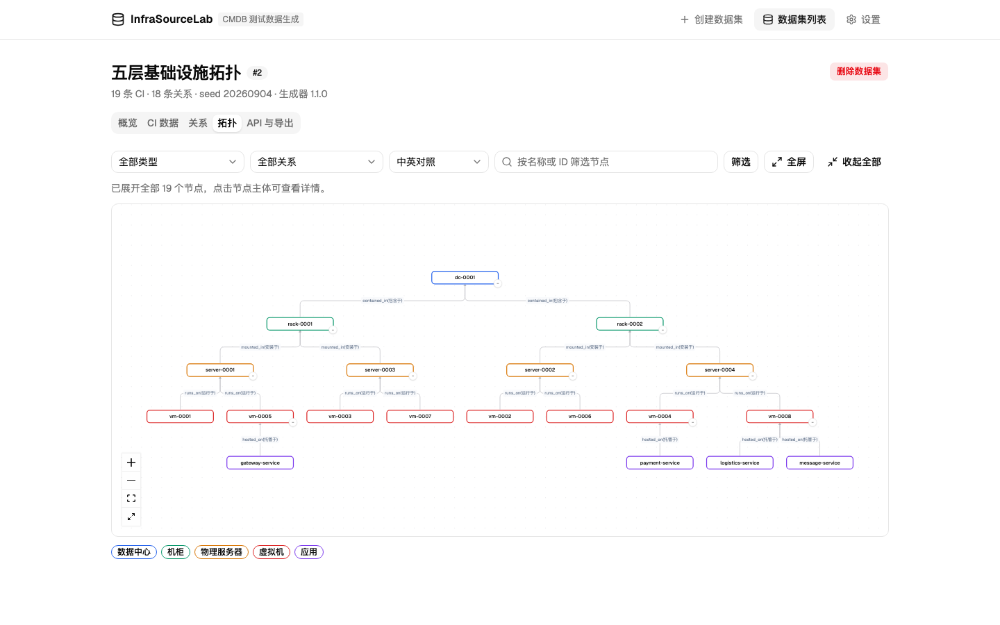
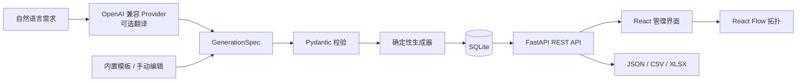

<div align="center">

# 🏭 InfraSourceLab

**Describe the infrastructure. Generate reliable test data.**

自然语言驱动、确定性、可复现的 CMDB 测试数据生成器。

[](https://github.com/john-ops-lab/InfraSourceLab/releases)
[](LICENSE)
[](backend/)
[](web/)
[](https://github.com/john-ops-lab/InfraSourceLab/actions/workflows/ci.yml)
[](docs/status.md)
[](Dockerfile)

[30 秒理解](#-30-秒理解) · [快速开始](#-快速开始) · [REST API](#-rest-api) · [项目文档](#-项目文档)

</div>

---

## InfraSourceLab 是什么？

做 CMDB、资产管理、数据治理或导入测试时，最先卡住的往往不是代码，而是**没有一套像真实企业环境的数据**：服务器、虚拟机、应用和数据库要有合理字段，还要彼此连得起来。

InfraSourceLab 把这件事变成一条可重复的流水线：

```text
一句自然语言 / 内置模板
          ↓
可检查、可修改的 GenerationSpec
          ↓
确定性生成器（规范化规格 + seed + 生成器版本固定）
          ↓
CI、关系、拓扑、REST API、JSON / CSV / XLSX
```

它不是一组写死的假数据，而是一间**基础设施数据实验室**：你定义环境长什么样，它负责稳定地造出来。

## 为什么做？

- **CMDB 是一张图，不是几张孤立的表。** 只有 CI 没有关系，验证不了拓扑、影响分析和依赖查询。
- **测试数据必须能重放。** 随机数据每次都变，失败难复现；InfraSourceLab 把随机性固定在 `seed` 里。
- **AI 应该帮人表达需求，不应该逐条“编”数据。** AI 只负责把自然语言翻译为受约束的规格，真正的数据由本地生成器产生。
- **没有 AI 也应该能工作。** 内置模板和手动规格编辑走同一条生成通道，离线环境照样可用。
- **造完的数据要能直接被消费。** 页面查询、拓扑钻取、Bearer Token API 和多格式导出都围绕同一份数据集。

## ⚡ 30 秒理解

### 1. 先定义“要什么”

输入一句需求，或直接选择内置模板。系统先给出 `GenerationSpec`，你可以调整 CI 数量、关系方向、覆盖策略、脏数据规则和随机种子，再确认生成。

> 以下截图均来自本机运行的 InfraSourceLab，内容是生成器创建的合成演示数据，不是真实企业资产或人员信息。



### 2. 再生成一份可复现的数据集

下面的示例生成了 40 个应用、12 个数据库、6 个中间件，以及 58 条关系。页面会保留生成规格、`seed` 和生成器版本，方便以后复现。



### 3. 查询、筛选并交给其他系统

CI 和关系支持分页、按类型筛选与关键字搜索；同一份数据也可以通过 REST API 获取，或导出为 JSON、CSV（ZIP）和 XLSX。



### 4. 从数据中心一路钻取到应用

拓扑默认从顶层节点开始，按需逐层展开。关系标签可切换中文、英文或中英对照，也可以聚焦邻居、筛选关系和进入全屏。为了把层级讲清楚，下图使用了另一份专门的五层拓扑演示数据（19 个 CI、18 条关系）。



## 核心能力

| 能力 | 能做什么 |
| --- | --- |
| 自然语言 → 规格 | 使用 OpenAI 兼容服务，把一句需求转换为经过校验的 `GenerationSpec` |
| 模板与手动编辑 | 无需 AI；从内置模板开始，调整类型、数量、关系、seed 和质量规则 |
| 确定性生成 | 规范化的 `GenerationSpec`、seed 和生成器版本一致时，生成结果完全一致 |
| CI 与关系模型 | 内置 12 种 CI 类型、15 种关系类型；关系无重复边、无悬空引用 |
| 关系类型注册表 | 在设置页维护中英文名称、方向和拓扑层级；支持自定义关系类型 |
| 数据质量注入 | 按规则制造缺字段、异常值等脏数据，用来测试导入和校验逻辑 |
| 拓扑钻取 | 折叠/展开、关系感知抽样、筛选、邻居聚焦、中英文标签和全屏 |
| 数据消费 | Bearer Token REST API，以及 JSON、CSV（ZIP）、XLSX 导出 |
| 双通道认证 | 管理员登录会话用于页面管理，`ISL_API_KEY` 用于脚本和系统集成 |

### AI 的边界

AI 只生成一份候选规格，不直接生成几万条 CI。候选规格必须先通过本地 Pydantic 校验，并且会完整展示给用户确认；真正的 CI、关系、ID 和字段全部由确定性生成器创建。

因此，即使 AI Provider 不可用，模板、手动编辑、数据生成、查询、拓扑和导出仍然可以正常工作。

## 适合什么？

| 很适合 | 不打算替代 |
| --- | --- |
| CMDB / ITSM 导入联调 | 真实资产发现或自动采集 |
| 数据清洗、校验和映射测试 | 生产 CMDB 的长期数据存储 |
| 拓扑、依赖和影响分析原型 | 专业网络仿真器 |
| Demo、培训、自动化测试夹具 | 隐私脱敏平台或真实数据迁移工具 |

## 🚀 快速开始

### Docker（推荐）

```bash
git clone https://github.com/john-ops-lab/InfraSourceLab.git
cd InfraSourceLab
cp .env.example .env

# 编辑 .env，至少设置一个自己的 ISL_API_KEY
docker compose up -d --build
curl http://127.0.0.1:8080/health
```

浏览器打开 `http://127.0.0.1:8080`。默认管理员账号是 `admin` / `admin123`；它只适合本地首次登录，在可信内网使用前请到设置页修改密码。项目默认仅绑定本机回环地址，不应直接暴露到公网。

如果希望使用自然语言建议，再在设置页或 `.env` 中配置 OpenAI 兼容的 `base_url`、`api_key` 和 `model`。不配置不会影响模板和手动生成。

### 本地开发

```bash
# 终端 1：后端（http://127.0.0.1:8080）
cd backend
uv sync --frozen
ISL_API_KEY=dev-key uv run python -m app.main

# 终端 2：前端（自动代理 /api 到后端）
cd web
npm ci
npm run dev
```

## 架构



| 层 | 技术与职责 |
| --- | --- |
| Web | React 19、TypeScript、Vite、Tailwind CSS v4、shadcn/ui |
| 拓扑 | React Flow（`@xyflow/react`） |
| API | FastAPI、Pydantic、Bearer Token / 管理员会话认证 |
| 生成与存储 | Python 确定性生成器、SQLAlchemy、SQLite |
| 交付 | 单镜像 Docker，后端同时提供前端静态资源 |

### 三个核心对象

| 对象 | 作用 |
| --- | --- |
| `GenerationSpec` | 描述要生成哪些 CI、数量、关系规则、seed 和质量缺陷 |
| `CIRecord` | 一条配置项记录，包含稳定 ID、类型、名称和类型化属性 |
| `CIRelation` | 一条有方向的关系边，连接两个真实存在的 CI |

## 🔌 REST API

除公开的 `/health`、`/api/v1/status` 和 `/api/v1/auth/login` 外，业务接口都需要 `Authorization: Bearer <ISL_API_KEY>` 或有效的管理员登录会话；修改系统配置还必须使用管理员会话。

| 方法 | 路径 | 说明 |
| --- | --- | --- |
| `POST` | `/api/v1/specs/from-prompt` | 自然语言 → 校验过的规格建议 |
| `POST` | `/api/v1/datasets` | 确认后的规格 → 数据集 |
| `GET` | `/api/v1/datasets` | 分页获取数据集列表 |
| `GET` | `/api/v1/datasets/{id}/cis` | 分页、筛选和搜索 CI |
| `GET` | `/api/v1/datasets/{id}/relations` | 查询关系数据 |
| `GET` | `/api/v1/datasets/{id}/topology` | 获取拓扑节点和边 |
| `GET` | `/api/v1/datasets/{id}/export?format=json\|csv\|xlsx` | 导出文件（CSV 为 ZIP） |
| `GET` | `/api/v1/relation-types` | 获取关系类型注册表 |
| `POST/PUT/DELETE` | `/api/v1/admin/relation-types` | 管理自定义关系类型（仅管理员） |

服务启动后可以在 [`http://127.0.0.1:8080/docs`](http://127.0.0.1:8080/docs) 查看并直接调用完整接口。

## 测试

```bash
cd backend && uv run pytest        # 106 个后端用例
cd web && npm test                 # 24 个 Vitest 单元测试
cd web && npx playwright test      # 12 个浏览器端到端用例
```

## 📚 项目文档

- [项目状态](docs/status.md) · [产品定义](docs/product.md) · [精简架构](docs/architecture.md)
- [GenerationSpec 与数据模型](docs/scenario-model.md) · [生成与接口策略](docs/backend-strategy.md)
- [前端设计](docs/frontend-design.md) · [安全与许可证](docs/security-and-licensing.md)
- [CMDB 使用示例](docs/cmdb-usage-example.md) · [开发与代码审查流程](docs/development-workflow.md) · [路线图](docs/roadmap.md)

## 参与和反馈

- 遇到问题或希望增加 CI / 关系类型：[提交 Issue](https://github.com/john-ops-lab/InfraSourceLab/issues)
- 准备贡献代码前，请先阅读[开发与代码审查流程](docs/development-workflow.md)

## 许可证

[Apache License 2.0](LICENSE)
